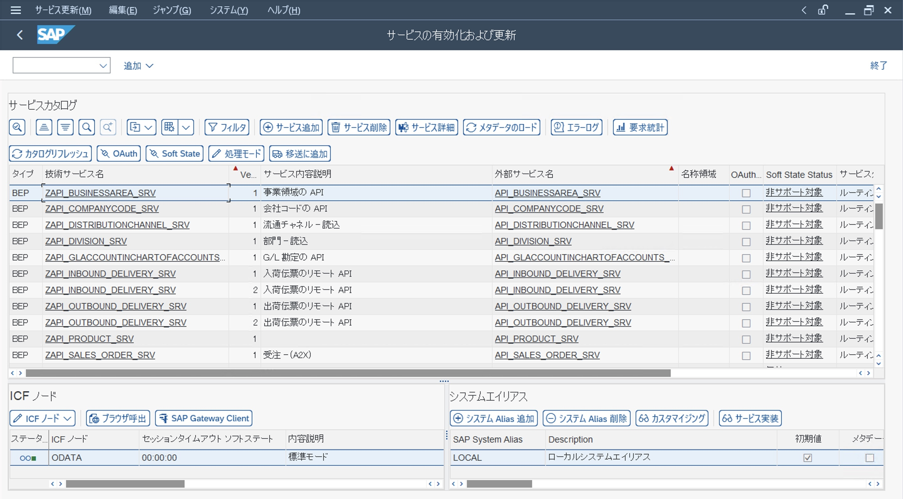

  
 
 Starting Up the API Environment on a "Full-of-Beans" SandBox 

***

# sap-api-service-validation-sandbox
sap-api-service-validation-sandbox は、それぞれの SAP APIサービスが、Latonaが整備したSAP環境内で、有効化されているかどうかを示したレポジトリです。  
sap-api-service-validation-sandbox の 「sandbox」は、Netflix 韓国ドラマ 「START-UP」 より、すべての開発者のための 地ならし になればという想いから命名されました。  
なお、各リポジトリのリソースは、そのままクラウド環境におけるアプリケーションにも適用可能です。  

## 前提条件  
sap-api-service-validation-sandbox は、オンプレミス版である（＝クラウド版ではない）SAPS4HANA API の利用を前提としています。  
クラウド版APIを利用する場合は、ご注意ください。  

## Latona における SAP 領域・機能ごと の リソース整備状況    
下の図において、チェックマークが付いているリソースが、Latonaにおいて(少なくとも1次の)整備が行われたものであり、github上に公開されています。  

## Latonaが整備したSAP環境内における有効化されたSAP APIサービスの確認画面
下の図において、サービスカタログに表示されているAPIサービスが、Latonaが整備したSAP環境内において有効化されたSAP APIサービスです。

